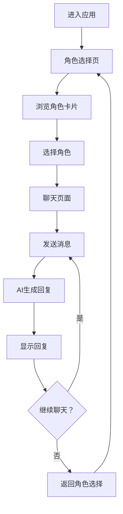

## 1. 产品概述

假面男友是一款基于AI的虚拟男友聊天应用，用户可以选择不同性格类型的虚拟男友进行沉浸式对话体验。核心价值在于满足用户的情感陪伴需求，提供多样化的聊天互动。

- **目标用户**：年轻女性群体，寻求情感陪伴和趣味聊天
- **核心功能**：多角色选择、智能对话、聊天记录保存
- **市场价值**：填补虚拟伴侣市场空白，提供差异化角色体验

## 2. 核心功能

### 2.1 用户角色
| 角色 | 注册方式 | 核心权限 |
|------|----------|----------|
| 普通用户 | 无需注册 | 选择角色、发起对话、查看历史记录 |

### 2.2 角色类型
| 角色名称 | 性格特点 | 聊天风格 |
|----------|----------|----------|
| 小奶狗 | 可爱、黏人、撒娇 | 亲昵称呼、可爱表情包、依赖性强 |
| 霸道总裁 | 高冷、强势、宠溺 | 命令式语气、占有欲表达、经济实力展示 |
| 中年大叔 | 稳重、成熟、体贴 | 关怀备至、人生哲理、经验分享 |
| 阳光少年 | 活力、开朗、热情 | 积极向上、运动话题、青春活力 |
| 高冷男神 | 沉默、神秘、禁欲 | 极简回复、深邃眼神、若即若离 |

### 2.3 功能模块
1. **角色选择页**：展示5种角色卡片，包含头像、名称、性格标签
2. **聊天页面**：实时对话界面，消息气泡、发送输入框、表情选择
3. **历史记录**：保存聊天记录，支持切换角色继续对话

### 2.4 页面详情
| 页面名称 | 模块名称 | 功能描述 |
|----------|----------|----------|
| 角色选择页 | 角色卡片 | 展示5个角色，点击进入对应聊天 |
| 角色选择页 | 导航栏 | 返回按钮、应用标题 |
| 聊天页面 | 消息列表 | 展示对话历史，支持滚动加载 |
| 聊天页面 | 输入区域 | 文本输入、发送按钮、表情选择 |
| 聊天页面 | 角色信息栏 | 角色头像、名称、在线状态 |

## 3. 核心流程

用户进入应用 → 浏览角色卡片 → 选择心仪角色 → 进入聊天页面 → 发送消息 → AI回复 → 持续对话 → 可返回切换角色

## 4. 用户界面设计

### 4.1 设计风格
- **主色调**：粉色渐变系（#FFB6C1 → #FF69B4），浪漫温馨
- **辅助色**：紫色点缀（#9B59B6），增添神秘感
- **按钮风格**：圆角、渐变、悬停发光效果
- **字体**：中文使用"思源黑体"，英文使用"Playfair Display"
- **布局**：卡片式设计，柔和阴影，留白充足
- **动画**：角色卡片悬停缩放、消息气泡淡入、打字光标闪烁

### 4.2 页面设计概览

**角色选择页**
| 模块名称 | UI元素 |
|----------|--------|
| 页面标题 | "假面男友"大标题，渐变字体，居中 |
| 角色卡片 | 5个圆形卡片，包含角色头像、名称、3个性格标签 |
| 卡片交互 | 悬停放大1.05倍，显示性格描述，点击进入聊天 |

**聊天页面**
| 模块名称 | UI元素 |
|----------|--------|
| 顶部栏 | 角色头像（圆形）、名称、返回箭头、在线状态绿点 |
| 消息区域 | 左侧角色消息（浅粉色气泡）、右侧用户消息（紫色气泡） |
| 输入区域 | 文本输入框（圆角）、发送按钮（心形图标）、表情按钮 |
| 滚动条 | 自定义粉色滚动条 |

### 4.3 响应式设计
- **桌面端**：角色卡片横向排列，聊天区域宽屏显示
- **平板端**：角色卡片3列排列，聊天区域自适应
- **移动端**：角色卡片单列垂直排列，聊天界面全屏

### 4.4 视觉细节
- 角色头像采用用户上传的自定义图片
- 消息气泡带有微妙渐变和阴影
- 输入框获得焦点时有柔和光晕
- 聊天背景使用渐变或模糊效果

## 5. 部署方案
- **托管平台**：GitHub Pages
- **构建工具**：Vite
- **部署方式**：静态站点直接部署，前端通过API密钥直接调用千问API