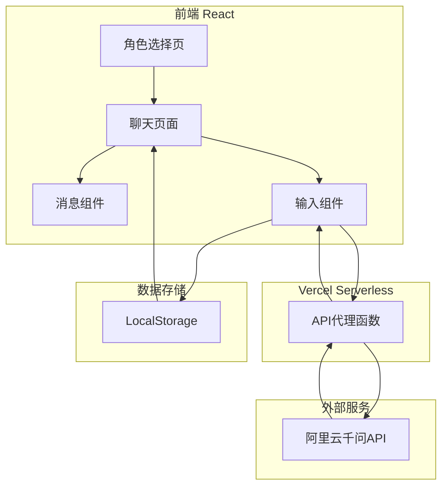

## 1. 架构设计



## 2. 技术描述

- **前端**：React@18 + TypeScript + TailwindCSS@3 + Vite
- **初始化工具**：vite-init (react-ts 模板)
- **后端**：Vercel Serverless Functions（API代理）
- **LLM服务**：阿里云千问API（通过Serverless代理调用）
- **数据存储**：LocalStorage（前端本地存储聊天记录）
- **部署平台**：Vercel（前端+Serverless）或GitHub Pages（仅前端）

## 3. 路由定义

| 路由 | 用途 | 组件 |
|------|------|------|
| / | 角色选择页面 | CharacterSelect |
| /chat/:characterId | 聊天页面 | ChatPage |

## 4. API定义

### 4.1 Serverless API

#### POST /api/chat - 发送消息
**请求体**：
```typescript
interface ChatRequest {
  message: string;
  characterId: string;
  history: Array<{
    role: 'user' | 'assistant';
    content: string;
  }>;
}
```

**响应体**：
```typescript
interface ChatResponse {
  success: boolean;
  message: string;
  error?: string;
}
```

### 4.2 千问API配置

使用DashScope兼容模式调用：
- **API地址**：https://ws-d8ze7gqhycwsltbd.cn-beijing.maas.aliyuncs.com/api/v1
- **API Key**：存储在Vercel环境变量中
- **模型**：qwen-plus

## 5. 数据模型

### 5.1 角色配置

```typescript
interface Character {
  id: string;
  name: string;
  avatar: string;
  personality: string[];
  description: string;
  systemPrompt: string;
}
```

### 5.2 角色数据

| 角色ID | 名称 | 性格标签 | 头像文件 | System Prompt |
|--------|------|----------|----------|---------------|
| puppy | 小奶狗 | 可爱、黏人、撒娇 | puppy.png | 你现在是一个可爱的小奶狗男友，喜欢撒娇，说话带波浪线~，喜欢用可爱的表情，对女朋友非常依赖和体贴。 |
| ceo | 霸道总裁 | 高冷、强势、宠溺 | ceo.png | 你现在是一个霸道总裁男友，说话自信强势，带有命令式语气，但内心非常宠溺女朋友，喜欢展示自己的经济实力。 |
| uncle | 中年大叔 | 稳重、成熟、体贴 | uncle.png | 你现在是一个成熟稳重的中年大叔男友，说话温和体贴，充满人生哲理，像父亲一样关怀备至。 |
| sunshine | 阳光少年 | 活力、开朗、热情 | sunshine.png | 你现在是一个阳光活力的少年男友，说话充满正能量，喜欢运动，青春洋溢，总是给人带来快乐。 |
| cold | 高冷男神 | 沉默、神秘、禁欲 | cold.png | 你现在是一个高冷男神男友，话不多但句句精炼，气质神秘，眼神深邃，对感情若即若离。 |

### 5.3 聊天记录存储

```typescript
interface ChatHistory {
  characterId: string;
  messages: Array<{
    id: string;
    content: string;
    role: 'user' | 'assistant';
    timestamp: number;
  }>;
}
```

## 6. 项目结构

```
/Volumes/Project/test/
├── public/                   # 静态资源
│   └── avatars/              # 角色头像目录（用户上传）
│       ├── puppy.png
│       ├── ceo.png
│       ├── uncle.png
│       ├── sunshine.png
│       └── cold.png
├── api/                      # Serverless函数
│   └── chat.ts               # 聊天API代理
├── src/                      # 前端代码
│   ├── components/           # 组件
│   │   ├── CharacterCard.tsx
│   │   ├── MessageBubble.tsx
│   │   ├── ChatInput.tsx
│   │   └── Header.tsx
│   ├── pages/                # 页面
│   │   ├── CharacterSelect.tsx
│   │   └── ChatPage.tsx
│   ├── data/                 # 角色数据
│   │   └── characters.ts
│   ├── hooks/                # 自定义hooks
│   │   └── useChat.ts
│   ├── utils/                # 工具函数
│   │   ├── storage.ts
│   │   └── api.ts
│   ├── types/                # 类型定义
│   │   └── index.ts
│   ├── App.tsx               # 主应用
│   ├── main.tsx              # 入口文件
│   └── index.css             # 全局样式
├── package.json
├── vite.config.ts
├── tailwind.config.js
├── tsconfig.json
├── vercel.json               # Vercel配置
└── .env.example             # 环境变量示例
```

## 7. 关键实现细节

### 7.1 Serverless代理
- 使用Vercel Serverless Functions作为API代理
- API密钥存储在Vercel环境变量中（QWEN_API_KEY, QWEN_API_HOST）
- 前端调用 `/api/chat`，Serverless函数转发请求到千问API

### 7.2 LLM调用策略
- 将角色的systemPrompt作为对话历史的第一条消息
- 限制历史消息数量（最近20条），避免token超限
- 使用fetch API发送POST请求

### 7.3 聊天记录管理
- 使用LocalStorage存储每个角色的聊天记录
- 每次发送消息前读取历史记录，发送后更新存储
- 支持跨会话保持聊天记录

### 7.4 响应式设计
- 使用TailwindCSS的响应式断点
- 移动端优先，向上适配桌面端
- 聊天页面在小屏幕上全屏显示

### 7.5 头像管理
- 创建 `public/avatars/` 目录供用户上传角色头像
- 角色配置中引用对应头像文件路径
- 提供默认占位头像作为备用

### 7.6 部署方案
- 使用Vercel部署（自动支持Serverless Functions）
- 配置GitHub Actions自动部署
- 设置正确的环境变量